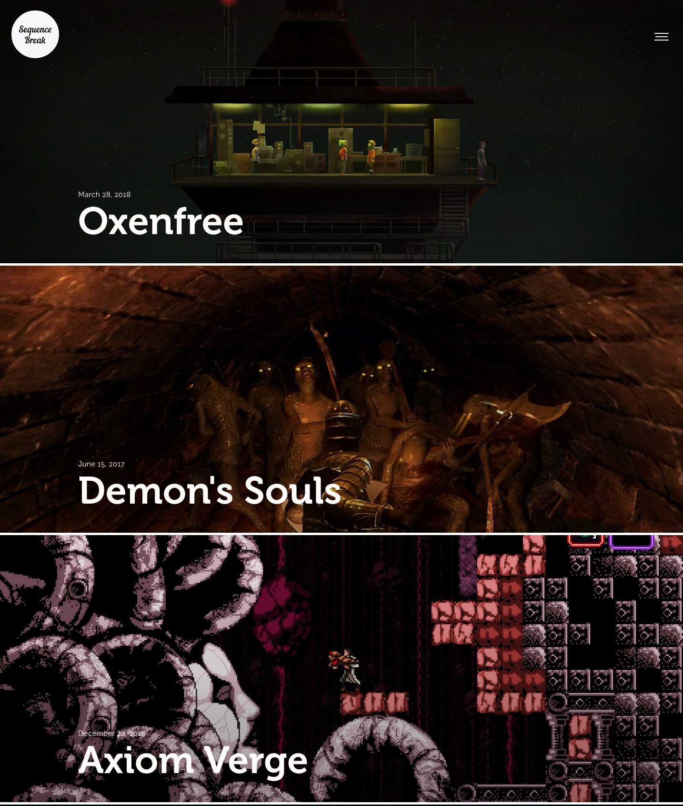

# GrvSqncBrk
Theme for [Grav](https://getgrav.org) CMS used for publishing [SqncBrk](https://sqncbrk.com).

## Known issues
1. **Performance issues** on high DPI screens in desktop Chrome and Safari. The culprit seems to be a combination of CSS Grid and [lazysizes](https://github.com/aFarkas/lazysizes).
2. **Fonts**. Fonts are not included with the theme distribution. SqncBrk uses [Museo](https://www.exljbris.com/museo.html) and [Museo Sans](https://www.exljbris.com/museosans.html) by exljbris Font Foundry, and [Alternate Gothic Pro](https://www.fontspring.com/fonts/softmaker/alternate-gothic-pro) by SoftMaker.
3. **Lazyloading**. Theme assumes you provide lazyloading library with the plugin. [Example for lazysizes](https://gist.github.com/ichik/3191c85570821170a86b581199f4a8ee).
4. **Compatibility**. Themes relies heavily on support of CSS Grid and doesn't provide any support for old browsers.
