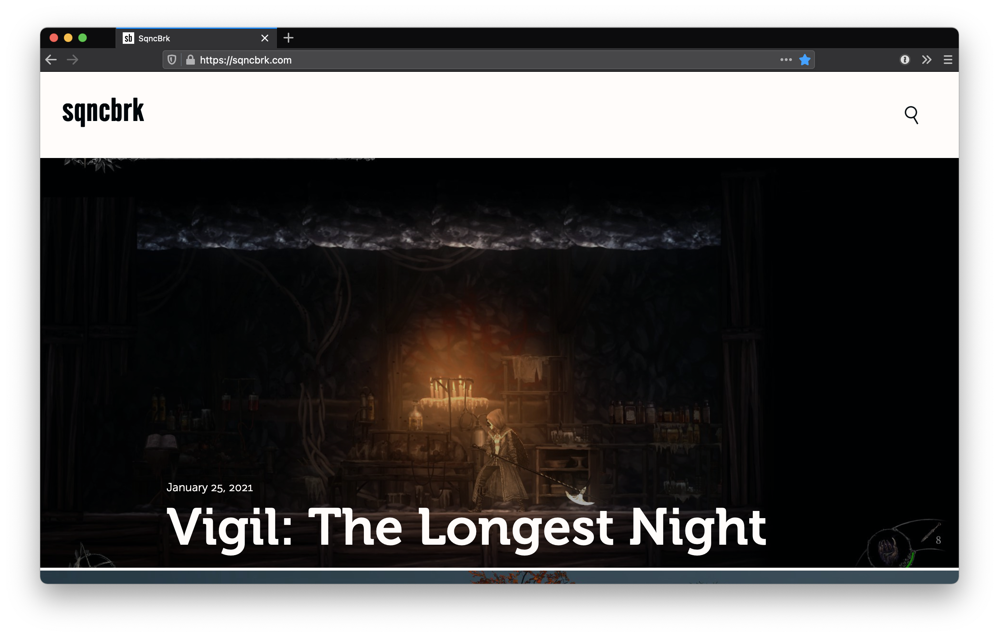

# GrvSqncBrk

Theme for [Grav](https://getgrav.org) CMS used for publishing [SqncBrk](https://sqncbrk.com).


## Considerations

1. **Fonts**. Fonts are not included with the theme distribution. SqncBrk uses [Museo](https://www.exljbris.com/museo.html) and [Museo Sans](https://www.exljbris.com/museosans.html) by exljbris Font Foundry, and [Alternate Gothic Pro](https://www.fontspring.com/fonts/softmaker/alternate-gothic-pro) by SoftMaker.
2. **Lazyloading**. Theme assumes you provide additional lazyloading optimizations with [Lazysizes library](https://github.com/aFarkas/lazysizes). Cover images should work without, but content of pages, video covers and iframe-type content is better handled by it. [Example plugin](https://gist.github.com/ichik/3191c85570821170a86b581199f4a8ee).
3. **Cover image**. Theme expects to find `cover.jpg` and (optional) `cover.webp` in every page folder to create previews. You can use variery of tools to generate needed image formats, i.e. [Squoosh](https://github.com/GoogleChromeLabs/squoosh/tree/dev/cli)
4. **Frontmatter**. Some additional optional frontmatter is used to provide non-standard data, check the following example:

```markdown
platform: [Windows, macOS, Linux, DSi, 3DS, Wii, GP2X]
release: 2004
developer: Studio Pixel
developersite: http://studiopixel.sakura.ne.jp
description: It’s not easy to even start talking about Cave Story without starting to throw out such adjectives like “modern classic” or “cult underground hit”. But there, you have it, I just wrote it and I won’t take it back.
```

5. **Video covers**. Set by `videocover: true` and providing cover video in the same folder (`cover.mp4` and/or `cover.webm`).
6. **Custom CSS**. Set by `customcss: true` and providing CSS file in the same folder (`custom.css`). CSS won't be compressed and won't be appended to main theme stylesheets.
7. **Sidenotes**. Are created with `<aside class="caption">SIDENOTE</aside>` following the paragraph they should relate to.
8. **Modifying styles**. Theme is authored in SASS (_not SCSS_), source files are in `sass` folder, compiled minified CSS and maps in `css`.
